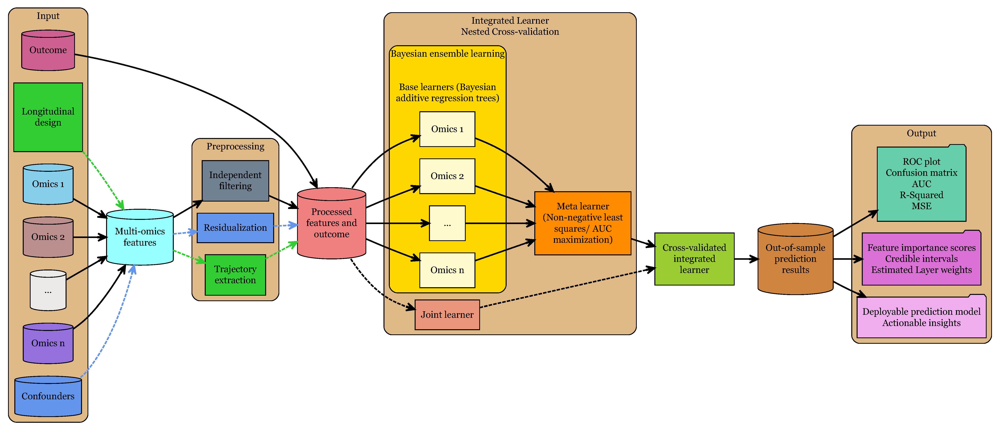

# IntegratedLearner - Integrated machine learning for multi-omics prediction and classification
## Introduction
The repository houses the **`IntegratedLearner`** R package for multi-omics prediction and classification. Both binary and continuous outcomes are supported.

## Getting started
### Dependencies

`IntegratedLearner` requires the following `R` package: `devtools` (for installation only). Please install it before installing `IntegratedLearner `, which can be done as follows (execute from within a fresh R session):

```r
install.packages("devtools")
library(devtools)
```

## Installation

Once the dependencies are installed, `IntegratedLearner` can be loaded using the following command:

```r
devtools::install_github("himelmallick/IntegratedLearner")
library(IntegratedLearner)
```

### Run IntegratedLearner in a container

IntegratedLearner can be run in a containerized environment using either Docker or Podman. It significantly simplifies the installation by ensuring that all the necessary packages are installed to run the provided vignette.

Refer to the installation instructions for your operating system for [Docker](https://docs.docker.com/engine/install/) or [Podman](https://podman.io/docs/installation). Then, in the terminal, run

```bash
# Pull the container image from the registry
docker pull ghcr.io/himelmallick/integratedlearner:master

# Start the container named IntegratedLearner on port 8787
docker run --port 8787:8787 --name IntegratedLearner integratedlearner:master
```

In the browser, navigate to `localhost:8787` and log in with `rstudio` username and the password that was displayed in the terminal.

In the R console, write `setwd("/opt/pkg")`. You can now open any file in the IntegratedLearner repository.

Podman is compatible with Docker commands, therefore `docker` command can be substituted with `podman`.

**NOTE**: if running rootless Podman, the correct username *might be* `root` instead of `rstudio`.

#### Map local directory to container directory

If you would like to make changes to the code, you need to *map* the local directory to a directory inside the container.
Otherwise, the modifications will be discarded when the container is stopped. To do so, we need to specify a volume option:

```bash
docker run -p 8787:8787 -v .:/IntegratedLearner --name IntegratedLearner integratedlearner:master
```

In this command, we *map* the current directory (for example, IntegratedLearner repository) to the `/IntegratedLearner`
directory inside the container. After logging in RStudio Server, in the console, write `setwd("/IntegratedLearner")` and modify the files.
The modifications made *inside* the container will be persistently saved in the current directory of the host system.

**NOTE**: if you are using SELinux (often enabled by default on Fedora), and you receive *Permission denied* errors when
accessing files inside the container, add a `:Z` flag to the volume option: `.:/IntegratedLearner:Z`.

## Features
* Supports early, late, and intermediate fusion with one line of code
* Dozens of algorithms: Random Forest, LASSO, Elastic Net, SVM, BART, and more
* Integrates with [SuperLearner](https://cran.r-project.org/web/packages/SuperLearner/index.html) to support even more options to quickly add custom algorithms to the ensemble
* Visualization using built-in plotting
* Hyperparameter tuning
* Screening algorithms
* Options to add new algorithms or change the default parameters for existing ones
* Nested cross-validation to estimate the performance of the integrated machine learner
* Multicore and multinode parallelization for scalability (**Not yet available**)

## Quickstart Guide

The package vignette demonstrates how to use the **IntegratedLearner** workflow to perform a multi-omics prediction and classification task. This vignette can be viewed online [here](http://htmlpreview.github.io/?https://github.com/himelmallick/IntegratedLearner/blob/master/vignettes/IntegratedLearner.html).

## Background

**`IntegratedLearner`** provides an integrated machine learning framework to 1) consolidate predictions by borrowing information across several longitudinal and cross-sectional omics data layers, 2) decipher the mechanistic role of individual omics features that can potentially lead to new sets of testable hypotheses, and 3) quantify uncertainty of the integration process. Three types of integration paradigms are supported: early, late, and intermediate. The software includes multiple ML models based on the [SuperLearner R package](https://cran.r-project.org/web/packages/SuperLearner/index.html) as well as several data exploration capabilities and visualization modules in a unified estimation framework.

At the core, the **`IntegratedLearner`** late fusion algorithm proceeds by 1) fitting a machine learning algorithm (```base_learner```) per-layer to predict outcome  and 2) combining the layer-wise cross-validated predictions using a meta model (```meta_learner```) to generate final predictions based on all available data points. As a default choice, we recommend [Bayesian additive regression trees (BART)](https://arxiv.org/abs/0806.3286) as the base learner (```base_learner = 'SL.BART'```) and non-negative least squares/ rank loss minimization as the meta model algorithm (```meta_learner = 'SL.nnls.auc'```). ```'SL.nnls.auc'``` fits a non-negative least squares (in case of a continuous outcome) and rank loss minimization (in case of binary outcome) on layer-wise cross-validated predictions to generate the final predictions and quantify per-layer contributions.

In addition, >50 ML algorithms are supported. Note that, all the learners must be named such that they are preceeded by the prefix `SL.` followed by the name of the learner or the associated package (e.g.,  `SL.randomForest`, `SL.BART`, `SL.glmnet`, etc.). Please check out the [SuperLearner user manual](https://cran.r-project.org/web/packages/SuperLearner/vignettes/Guide-to-SuperLearner.html) for all available options.

## Basic Usage

```
IntegratedLearner(feature_table, sample_metadata, feature_metadata, ...)
```
### Arguments

* ```feature_table ```: Data frame representing concatenated multi-omics features with features in rows (```rownames```) and samples in columns (```colnames```).
* ```sample_metadata ```: Data frame of sample-specific metadata. Must have a column named ```subjectID``` describing per-subject unique identifiers. For longitudinal designs, this variable is expected to have non-unique values. Additionally, a column named ```Y``` must be present which is the outcome of interest (can be binary or continuous). Row names of ```sample_metadata``` must match the column names of ```feature_table```.
* ```feature_metadata ```: Data frame containing feature-specific metadata. Must have a column named ```featureID``` describing per-feature unique identifiers. Additionally, if multiple omics layers are present, a column named ```featureType``` should describe the corresponding source layer (e.g. metagenomics, metabolomics, etc.). Row names must match that of ```feature_table```.
* ```feature_table_valid ```: Optional feature table from validation set. Must have the exact same structure as `feature_table`.
* ```sample_metadata_valid```: Optional sample-specific metadata table from independent validation set. Must have the exact same structure as `sample_metadata`.
* ```family```: A character string representing one of the built-in families. Currently, ```gaussian()``` and ```binomial()``` are supported.
* ```folds```: Integer. Number of folds for cross-validation. Default is 5.
* ```base_learner ```: Character string representing the name of the ```SL``` base-learner in stacked generalization and optionally for joint learner (see example). Check out the [SL user manual](https://cran.r-project.org/web/packages/SuperLearner/vignettes/Guide-to-SuperLearner.html) for all available options. Default is ```'SL.BART'```
* ```meta_learner```: Character string representing the name of the ```SL``` meta-learner in stacked generalization (see example). Check out the [SL user manual](https://cran.r-project.org/web/packages/SuperLearner/vignettes/Guide-to-SuperLearner.html) for all available options. Default is ```'SL.nnls.auc'```
* ```run_concat```: Logical value representing whether a joint (concatenated) model should also be run (see tutorial). Default is TRUE.
* ```run_stacked```: Logical value representing whether a stacked model should also be run (see tutorial). Default is TRUE.
* ```print_learner```: Logical value representing whether a summary of fit should be printed. Default is TRUE.
* ```verbose```: Logical value for printing progress during the computation (helpful for debugging). Default is FALSE.
* ```...```: Additional arguments for `SL` tuning parameters.

#### The IntegratedLearner workflow



#### Value

* ```SL_fits```: A list of ```SL``` prediction results from all individual base learners, the meta learner, and optionally the joint (concatenation) learner.
* ```model_fits```: A list of ```base_learner``` objects extracted from ```SL_fits``` for all individual base learners, meta learner, and optionally the joint (concatenation) learner.
* ```X_train_layers```: Input feature matrices for individual layers for training data.
* ```Y_train```: Input response vector for training data.
* ```yhat.train```: Predictions for training data from all individual base learners, the meta learner, and optionally the joint (concatenation) learner.
* ```X_test_layers```: Input feature matrices for individual layers for test data. Available if ```feature_table_valid``` is provided.
* ```Y_test```: Input response vector for test data.
* ```weights```: Estimated layer weights in the meta model. Available if ```run_stacked=TRUE``` and ```meta_learner='SL.nnls.auc'```.
* ```AUC.train```/```R2.train```: AUC/ R2 metrics calculated on training data using ```yhat.train``` and ```Y_train```.
* ```AUC.test```/```R2.test```: AUC/ R2 metrics calculated on test data using ```yhat.test``` and ```Y_test```.
* ```...```: Additional arguments containing information about inputs.

Citation
--------

If you use `IntegratedLearner` in your work, please cite the following:

Mallick H et al. (2024). [An Integrated Bayesian Framework for Multi-omics Prediction and Classification](https://onlinelibrary.wiley.com/doi/10.1002/sim.9953). *Statistics in Medicine* 43(5):983–1002.

Issues
------

We are happy to troubleshoot any issues with the package. Please contact the maintainer via email or [open an issue](https://github.com/himelmallick/IntegratedLearner/issues) in the GitHub repository.

Future Release
--------------

We are currently in the process of submitting
**`IntegratedLearner`** to [Bioconductor](https://www.bioconductor.org/). Likewise, please keep an eye out for a future release of **`IntegratedLearner`** as an R/Bioconductor package while this repository remains the development version of the package.
