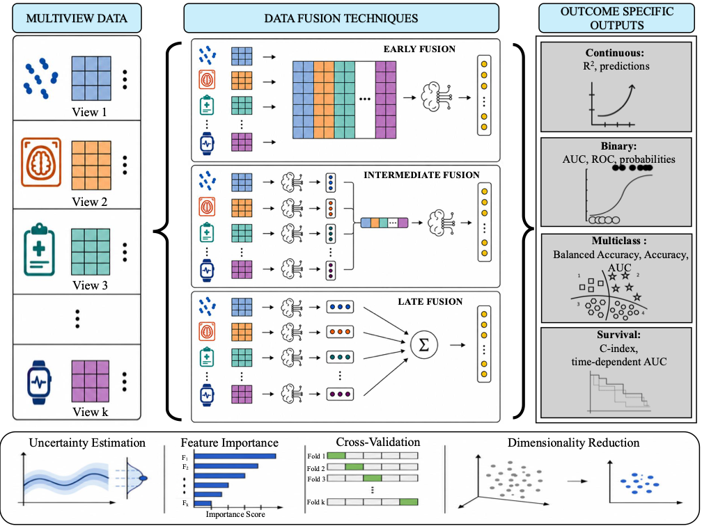

---
output:
  pdf_document: default
  html_document: default
---
# IntegratedLearner - Integrated machine learning for multi-omics prediction and classification

The repository houses the **`IntegratedLearner`** R package for multi-omics prediction and classification. Binary, continuous, and survival outcomes are supported through a single high-level interface.

## Dependencies

`IntegratedLearner` requires the following `R` package: `devtools` (for installation only). Please install it before installing `IntegratedLearner`, which can be done as follows (execute from within a fresh R session):

```r
install.packages("devtools")
library(devtools)
```

## Installation

Once the dependencies are installed, `IntegratedLearner` can be loaded using the following command:

```r
devtools::install_github("himelmallick/IntegratedLearner")
library(IntegratedLearner)
```

## Features
* Supports both `PCL` and `MAE` input modes
* Supports binary, continuous, and survival outcomes
* Supports early, late, and intermediate fusion in one interface
* Integrates with [SuperLearner](https://cran.r-project.org/web/packages/SuperLearner/index.html) for non-survival models (`SL.*`)
* Uses `mlr3`/`mlr3proba` ecosystem for survival models (`surv.*`)
* Visualization using built-in plotting
* Built-in layer weights and feature-importance outputs for interpretability
* Nested cross-validation to estimate prediction performance
* Multicore and multinode parallelization for scalability (**Not yet available**)

## Quickstart Guide

The package vignette demonstrates binary, continuous, survival, `PCL`, and `MAE` workflows. This vignette can be viewed online [here](http://htmlpreview.github.io/?https://github.com/himelmallick/IntegratedLearner/blob/master/vignettes/IntegratedLearner.html).

## Background

**`IntegratedLearner`** provides an integrated machine learning framework to 1) consolidate predictions by borrowing information across several longitudinal and cross-sectional omics data layers, 2) decipher the mechanistic role of individual omics features that can potentially lead to new sets of testable hypotheses, and 3) quantify uncertainty of the integration process. Three integration paradigms are supported: early, late, and intermediate.

For non-survival outcomes, late fusion proceeds by 1) fitting a machine learning algorithm (`base_learner`) per layer and 2) combining layer-wise cross-validated predictions using a meta model (`meta_learner`). A common default is [BART](https://arxiv.org/abs/0806.3286) as base learner (`base_learner = "SL.BART"`) with `SL.nnls.auc` as the meta-learner.

For survival outcomes, `IntegratedLearner` dispatches to the survival engine (`ILsurv`) and supports `mlr3` survival learners (for example, `surv.coxph`, `surv.coxboost`, `surv.ranger`) with configurable late-fusion weighting (`COX`/`IBS`) and optional intermediate fusion.

For non-survival tasks, learners should use the `SL.` prefix (for example, `SL.randomForest`, `SL.BART`, `SL.glmnet`). See the [SuperLearner user manual](https://cran.r-project.org/web/packages/SuperLearner/vignettes/Guide-to-SuperLearner.html) for additional options.

## Basic Usage

```r
# PCL mode (binary/continuous/survival)
IntegratedLearner(
  PCL_train = pcl_train,
  PCL_valid = pcl_valid,        # optional
  folds = 5,
  base_learner = "SL.randomForest",
  meta_learner = "SL.nnls.auc",
  family = binomial()
)

# MAE mode (binary/continuous/survival)
IntegratedLearner(
  MAE_train = mae_train,
  MAE_valid = mae_valid,        # optional
  experiment = c("taxonomy", "pathway"),
  assay.type = c("relative_abundance", "pathway_abundance"),
  folds = 5,
  base_learner = "surv.coxph",
  weight_method = "COX"
)
```
### Arguments

* `MAE_train` / `MAE_valid`: `MultiAssayExperiment` inputs for training and optional validation.
* `PCL_train` / `PCL_valid`: List inputs (`feature_table`, `sample_metadata`, `feature_metadata`) for training and optional validation.
* `experiment`: Selected MAE experiment names/indices (optional; defaults to all in `MAE_train`).
* `assay.type`: Assay name per selected MAE experiment.
* `na.rm`: Logical; drop features containing missing values after extraction/prep.
* `folds`: Integer. Number of folds for cross-validation. Default is `5`.
* `seed`: Integer seed for reproducibility. Default is `1234`.
* `base_learner`: Non-survival uses `SL.*` learners; survival uses supported `surv.*` learners.
* `meta_learner`: Meta learner for non-survival late fusion. Default is `"SL.nnls.auc"`.
* `run_concat`: Logical; include early-fusion (concatenated) model for non-survival.
* `run_stacked`: Logical; include late-fusion stacked model for non-survival.
* `family`: Typically `gaussian()` or `binomial()` for non-survival. Survival is auto-detected from metadata or family.
* `verbose`: Logical progress flag.
* `...`: Additional backend parameters. For survival, this includes options such as `weight_method`, `do_early_fusion`, and `intermediate_learners`.

Supported model families:

* Non-survival: any available `SuperLearner` `SL.*` model.
* Survival: `surv.rfsrc`, `surv.ranger`, `surv.coxboost`, `surv.bart`, `surv.coxph`, `surv.glmnet`.

Supported fusion modules:

* Non-survival: single-layer + early (`run_concat`) + late (`run_stacked`).
* Survival: single-layer + early (`do_early_fusion`) + late weighted fusion (`COX`/`IBS`) + intermediate (`intermediate_learners`).

#### The IntegratedLearner workflow



#### Value

For continuous/binary fits (`IL_conbin` path):

* `SL_fits`: Fitted SuperLearner objects (layer-wise, stacked, concatenated as applicable).
* `model_fits`: Extracted learner objects.
* `X_train_layers`, `Y_train`, `yhat.train`: training inputs and predictions.
* `X_test_layers`, `Y_test`, `yhat.test`: validation inputs and predictions (if validation provided).
* `weights`: Layer weights in stacked model (`meta_learner = "SL.nnls.auc"` and `run_stacked = TRUE`).
* `AUC.train`/`AUC.test` (binomial) or `R2.train`/`R2.test` (gaussian).
* `feature_importance_signed`: Global signed feature importance.
* `feature_importance_signed_by_layer`: Per-layer signed feature importance.

For survival fits (`ILsurv` path):

* `train_out$single`: Single-layer metrics.
* `train_out$early`: Early-fusion metrics (if enabled).
* `train_out$late`: Late-fusion metrics and learned layer weights (`train_out$late$weights`).
* `train_out$intermediate`: Intermediate learner metrics.
* `valid_out$...`: Validation analogs of single/early/late/intermediate outputs (if validation provided).
* `train_out$late$combined_importance` and (if available) `train_out$early$combined_importance`: survival feature-importance outputs.

Citation
--------

If you use `IntegratedLearner` in your work, please cite the following:

Mallick H et al. (2024). [An Integrated Bayesian Framework for Multi-omics Prediction and Classification](https://onlinelibrary.wiley.com/doi/10.1002/sim.9953). *Statistics in Medicine* 43(5):983–1002.

Issues
------

We are happy to troubleshoot any issues with the package. Please contact the maintainer via email or [open an issue](https://github.com/himelmallick/IntegratedLearner/issues) in the GitHub repository.

Future Release
--------------

We are currently in the process of submitting
**`IntegratedLearner`** to [Bioconductor](https://www.bioconductor.org/). Likewise, please keep an eye out for a future release of **`IntegratedLearner`** as an R/Bioconductor package while this repository remains the development version of the package.
